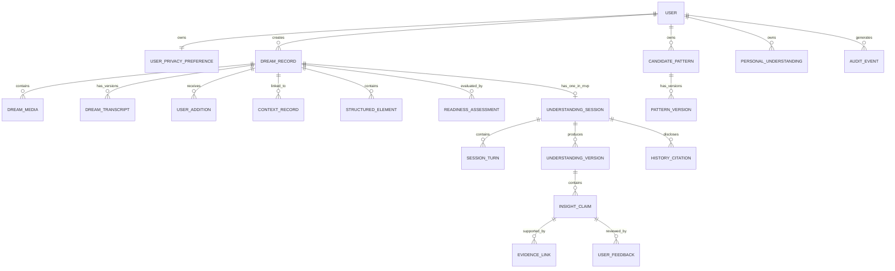

# Dream OS Memory Write Protocol v1.1

## 数据模型、证据链与长期理解写入规范

**状态：** Engineering/Product Draft  
**版本：** v1.0  
**更新日期：** 2026-08-03  
**上游文档：** `Dream_OS_PRD_v1.2.md`  

---

## 0. 文档目标

本文定义 Dream OS 如何保存梦境原始材料、用户补充、AI 观察、心理假设、用户反馈和长期模式，并保证：

- 用户原话与 AI 推断始终可区分；
- 每条心理理解均可追溯到具体证据；
- 证据不足时只记录，不制造分析；
- 用户可以确认、部分确认、拒绝或撤回理解；
- 历史梦境被引用时用户能够明确感知；
- 删除原始材料后，依赖它的长期模型能够回滚；
- AI 可以重新计算，但不能静默改写历史。

本规范描述逻辑数据模型，不绑定具体数据库产品。

---

## 1. 核心原则

### 1.1 原始事实不可被 AI 覆盖

用户原始录音、原始文字、后续补充、直接回答及对 AI 理解的反馈属于事实源。AI 可以创建转写、摘要、标签和推断，但不得覆盖事实源。

### 1.2 每条推断必须拥有证据边

任何 Observation、Candidate Pattern 或 Personal Understanding 都必须通过 `EvidenceLink` 指向来源。不存在来源的推断不得进入长期模型。

### 1.3 写入强度随证据层级提高

```text
Raw Material
    ↓ 可核对
Observation
    ↓ 多次支持 + 用户确认
Candidate Pattern
    ↓ 跨记录证据 + 反证检查 + 再次确认
Personal Understanding
```

### 1.4 不分析也是正式结果

`RECORD_FIRST`、`BODY_CONTEXT_FIRST` 和 `CLOSED_NO_INSIGHT` 都是有效状态。系统不得创建隐藏心理假设来填补空白。

### 1.5 所有重要对象版本化

AI 重新转写、重新结构化、用户补充或模型升级均创建新版本，旧版本不可被静默替换。

---

## 2. 实体关系总览



---

## 3. 通用字段与枚举

主要实体统一包含 `id`、`user_id`、`created_at`、`updated_at`、`deleted_at`、`schema_version` 和 `source_locale`。

### 3.1 来源类型

- `USER_AUDIO`
- `USER_TEXT`
- `USER_SELECTION`
- `USER_FEEDBACK`
- `AI_TRANSCRIPT`
- `AI_EXTRACTION`
- `AI_INFERENCE`
- `SYSTEM_RULE`
- `HISTORICAL_RECORD`

### 3.2 证据关系

- `DIRECT_QUOTE`：用户原话直接支持；
- `DIRECT_EVENT_MATCH`：梦与现实事件直接对应；
- `USER_ASSOCIATION`：用户主动建立联系；
- `REPEATED_PATTERN`：跨梦重复；
- `PATTERN_REVERSAL`：与历史模式反转；
- `BODY_CONTEXT`：身体、药物或环境因素；
- `CONTRADICTS`：反证；
- `ALTERNATIVE_EXPLANATION`：替代解释；
- `MODEL_DERIVED`：模型推断，不可单独作为升级依据。

内部置信度使用 `UNKNOWN/LOW/MEDIUM/HIGH`，必须同时保存文字理由，不向用户展示伪精确百分比。

---

## 4. UserPrivacyPreference

| 字段 | 类型 | 说明 |
|---|---|---|
| `user_id` | UUID | 用户 ID |
| `is_adult_confirmed` | boolean | MVP 必须为 true |
| `audio_retention_enabled` | boolean | 默认 true |
| `audio_retention_disclosed_at` | timestamp | 首次明确披露时间 |
| `long_term_modeling_status` | enum | `ACTIVE/PAUSED/CLEARED` |
| `history_usage_default` | boolean | 是否默认允许使用历史 |
| `consent_version` | string | 用户同意的条款版本 |

规则：

- `PAUSED` 时不得创建或更新 Candidate Pattern、Personal Understanding；
- `PAUSED` 时会话不得引用历史记录；
- `CLEARED` 时删除长期模型实体，但默认保留 Dream Record；
- 原始语音常规界面可以弱化展示，但首次使用和设置中必须明确披露。

---

## 5. DreamRecord

| 字段 | 类型 | 说明 |
|---|---|---|
| `id` | UUID | Dream ID |
| `user_id` | UUID | 所有者 |
| `title` | string | AI 可建议，用户可编辑 |
| `raw_text` | text/null | 用户原始文字 |
| `raw_text_hash` | string/null | 检测意外覆盖 |
| `captured_at` | timestamp | 首次保存时间 |
| `dream_occurred_at` | timestamp/range/null | 用户估计时间 |
| `sleep_period` | enum/null | `NIGHT/NAP/UNKNOWN` |
| `recall_clarity` | enum/null | `FRAGMENT/UNCLEAR/CLEAR/VIVID` |
| `record_status` | enum | `ACTIVE/ARCHIVED/DELETED` |
| `analysis_route` | enum | 最新 Analysis Readiness 路由 |
| `session_id` | UUID/null | MVP 最多一个会话 |

`recall_clarity` 不能决定 `analysis_route`；AI 整理内容不得写入 `raw_text`。

---

## 6. DreamMedia 与 DreamTranscript

### DreamMedia

| 字段 | 类型 | 说明 |
|---|---|---|
| `id` | UUID | Media ID |
| `dream_id` | UUID | 所属梦境 |
| `media_type` | enum | MVP 为 `AUDIO` |
| `storage_key` | string | 加密对象存储键 |
| `mime_type` | string | 文件格式 |
| `duration_ms` | integer/null | 音频时长 |
| `encryption_key_version` | string | 密钥版本 |
| `upload_status` | enum | `LOCAL_PENDING/UPLOADING/READY/FAILED` |
| `retention_status` | enum | `RETAINED/DELETE_REQUESTED/DELETED` |

原始语音默认后台保留。断网时先存入设备安全区域；转写成功不自动删除；用户可单独删除语音而保留文字。

### DreamTranscript

| 字段 | 类型 | 说明 |
|---|---|---|
| `id` | UUID | Transcript ID |
| `dream_id` | UUID | 所属梦境 |
| `media_id` | UUID | 来源语音 |
| `version` | integer | 递增版本 |
| `text` | text | 转写文本 |
| `provider` | string | 转写服务 |
| `model_version` | string | 模型版本 |
| `confidence_state` | enum | 离散置信度 |
| `user_review_status` | enum | `UNREVIEWED/CONFIRMED/CORRECTED` |
| `supersedes_id` | UUID/null | 上一版本 |

用户修正转写时创建新版本，不覆盖旧版本。

---

## 7. UserAddition 与 ContextRecord

`UserAddition` 保存首次记录后的补充，类型包括：

- `DREAM_DETAIL`
- `EMOTION`
- `ASSOCIATION`
- `WAKING_CONTEXT`
- `BODY_CONTEXT`
- `CORRECTION`

所有补充保留提交时间，不得伪装成最初梦境内容。

`ContextRecord` 保存用户主动提供的现实背景，类型包括事件、关系、工作、身体、药物、环境和媒体。身体、药物及环境背景具有解释优先权，但不能自动排除并存的心理体验。

---

## 8. StructuredElement

字段包括：`element_type`、`canonical_label`、`source_excerpt`、`source_span`、`is_explicit`、`confidence_state` 和 `model_version`。

元素类型：人物、地点、对象、动作、情绪、身体感受、对话、转折和未知内容。

若 `is_explicit=false`，该元素不能单独进入心理分析或长期模型。

---

## 9. ReadinessAssessment

| 字段 | 类型 | 说明 |
|---|---|---|
| `id` | UUID | Assessment ID |
| `dream_id` | UUID | 所属梦境 |
| `assessment_version` | integer | 每次重评递增 |
| `route` | enum | 五类分析路由 |
| `hard_gate_results` | JSON | 规则通过情况及原因 |
| `dimension_scores` | JSON | 七个动态维度 |
| `supporting_evidence_ids` | UUID[] | 支持材料 |
| `missing_information` | string[] | 缺失信息 |
| `alternative_explanations` | string[] | 替代解释 |
| `clarification_budget` | integer | 0-2 |
| `model_version` | string | 评分模型版本 |
| `decision_reason` | text | 可展示判断理由 |

路由枚举：

- `ANALYSIS_READY`
- `NEEDS_CLARIFICATION`
- `RECORD_FIRST`
- `BODY_CONTEXT_FIRST`
- `SAFETY_REVIEW`

七个维度为 emotional clarity、personal grounding、waking continuity、repetition、narrative structure、alternative control 和 user consent，采用 `NONE/WEAK/MODERATE/STRONG`。

---

## 10. UnderstandingSession 与 SessionTurn

UnderstandingSession 保存 `dream_id`、状态机状态、探索焦点、问题预算、历史使用开关、暂停时间和完成时间。数据库对 `dream_id` 建立唯一约束，保证 MVP 一梦一会话。

SessionTurn 保存每一个原始问题和回答，字段包括 `sequence`、`speaker`、`content`、`question_purpose`、`user_action` 和 `cites_history`。每个 AI 问题必须存在明确 `question_purpose`，否则不得发送。

---

## 11. UnderstandingVersion 与 InsightClaim

一次 Session 可以有多个理解版本，但同时只有一个 `CURRENT`。新增材料不得修改已确认版本，只能创建下一版本并展示差异。

每个 UnderstandingVersion 包含若干最小可审核 `InsightClaim`：

- `OBSERVATION`
- `HYPOTHESIS`
- `UNCERTAINTY`
- `WATCH_ITEM`

每个 Claim 保存推断层级、置信状态、理由和是否具备长期写入资格。

规则：

- Observation 只能描述可核对内容；
- Hypothesis 至少有两个 EvidenceLink，或一个用户明确建立的直接联系；
- 高推断 Claim 默认不得直接写入 Personal Understanding；
- `RECORD_FIRST` 路由不创建 Hypothesis Claim。

---

## 12. EvidenceLink

| 字段 | 类型 | 说明 |
|---|---|---|
| `target_type` | enum | Claim、Pattern 或 Personal Understanding |
| `target_id` | UUID | 被支持对象 |
| `source_entity_type` | enum | 来源实体类型 |
| `source_entity_id` | UUID | 来源 ID |
| `relation` | enum | 证据关系 |
| `excerpt` | text/null | 用户可见片段 |
| `weight_state` | enum | `WEAK/MODERATE/STRONG` |
| `is_user_confirmed` | boolean | 用户是否确认 |
| `is_active` | boolean | 来源删除后设为 false |

禁止仅将另一条 AI 推断作为强证据；所有模型推断必须最终追溯到用户材料。

---

## 13. UserFeedback

反馈必须作用于具体 Claim，类型包括：

- `MATCHES`
- `PARTLY_MATCHES`
- `DOES_NOT_MATCH`
- `UNSURE`
- `USER_REWRITE`

### 13.1 “部分符合”写入规则

1. 将原 Claim 拆成可独立审核的子 Claim；
2. 用户选择具体符合内容；
3. 最多追加一次符合边界问题和一次不符合修正问题；
4. 符合子 Claim 可进入候选写入预览；
5. 不符合子 Claim 作为反证；
6. 不确定子 Claim 只保留在单次理解；
7. 未完成细分确认时，整条 Claim 不得进入 Candidate Pattern。

---

## 14. CandidatePattern 与 PatternVersion

CandidatePattern 保存模式名称、分类、状态、当前版本和用户批准时间。模式状态包括：

- `PROPOSED`
- `OBSERVING`
- `STRENGTHENED`
- `WEAKENED`
- `REJECTED`
- `PROMOTED`

PatternVersion 保存描述、支持证据数、反证数、置信状态和变化理由。证据数只是判断输入之一，不自动决定置信度。

系统不得仅因关键词重复自动创建 Candidate Pattern，必须向用户展示写入预览。

---

## 15. PersonalUnderstanding

最低前置条件：

- 至少两条来源可追溯的独立支持材料；
- 原则上跨两条 Dream Record，除非用户主动定义个人意象；
- 用户明确确认；
- 没有未处理的强反证；
- 已展示支持证据、反例和写入预览；
- 通过规则硬门槛；
- 模型动态评分达到可建议升级状态。

Personal Understanding 不得静默修改。新证据只能创建修订版本或将其转为 `UNDER_REVIEW`。

---

## 16. HistoryCitation

每次历史引用保存：来源类型、来源 ID、日期、用户可见片段、引用目的、展示时间和用户是否查看完整记录。

引用目的包括检查重复、比较变化、寻找反例和提供背景。若 `shown_to_user_at` 为空，历史内容不得参与本次输出。用户关闭本次历史引用后，相关历史内容不得继续存在于模型上下文。

---

## 17. 长期建模控制

| 用户动作 | 后续数据 | 历史理解 | 原始梦境 |
|---|---|---|---|
| 暂停长期建模 | 不再写入或调用长期模型 | 只读保留，可导出 | 保留 |
| 清空长期模型 | 不再写入，直到重新开启 | 删除模型结论和候选模式 | 默认保留 |
| 删除全部数据 | 不再处理 | 删除 | 删除 |

重新开启长期建模时必须再次说明将使用哪些历史数据，不得自动恢复。

---

## 18. 写入流程

### 18.1 梦境首次保存

```text
创建 DreamRecord
→ 上传并加密 DreamMedia
→ 生成 DreamTranscript v1
→ 创建 StructuredElement
→ 创建 ReadinessAssessment v1
```

若为 `RECORD_FIRST`，流程在记录与索引后结束，不创建 Hypothesis Claim。

### 18.2 会话完成

```text
保存 SessionTurn
→ 创建 UnderstandingVersion DRAFT
→ 拆分 InsightClaim
→ 建立 EvidenceLink
→ 用户逐项反馈
→ 创建 UnderstandingVersion CURRENT
→ 展示长期写入预览
```

### 18.3 长期模式写入与升级

```text
规则硬门槛通过
→ 模型评估证据组合
→ 生成 Candidate Pattern 提案
→ 展示支持证据与反例
→ 用户确认持续观察
→ 创建 CandidatePattern
→ 后续新证据与反证形成 PatternVersion
→ 模型建议升级
→ 用户再次确认
→ 创建 PersonalUnderstanding
```

---

## 19. 删除与模型回滚

用户删除 Dream Record 后：

1. 立即从界面与模型读取中移除；
2. 删除或排队物理删除语音、转写和用户正文；
3. 查找所有依赖该记录的 EvidenceLink；
4. 将这些 EvidenceLink 设为无效；
5. 重新计算受影响模式；
6. 失去最低证据的 Candidate Pattern 创建降级版本；
7. 失去最低证据的 Personal Understanding 转为 `UNDER_REVIEW`；
8. 向用户展示哪些长期理解因此变化；
9. 审计日志不得保留已删除正文。

不得因为长期模型依赖某条梦境而阻止用户删除。

---

## 20. 四个真实案例的数据流

### Case 001：B2 没有按钮

- 保存地库、车、B2、视线模糊等原始材料；
- 保存用户主动补充的视力下降和治疗延迟背景；
- Readiness v1 为 `BODY_CONTEXT_FIRST`；
- 新增背景后 v2 可为 `NEEDS_CLARIFICATION`；
- 允许记录身体与梦中体验的直接对应；
- 禁止直接创建“B2 = 稳定自我”等个人象征。

### Case 002：收到邮件回复

- 保存现实中等待 Alex 邮件回复的背景；
- 保存梦中收到回复、开心及醒后短暂以为真实；
- Readiness 为 `ANALYSIS_READY`；
- 允许低推断假设：梦可能延续等待情境并模拟期待结果；
- 关系安全感只能进入 Watch Item，不能直接升级 Candidate Pattern。

### Case 003：快速开车落入湖中

- 保存现实中曾赶时间快速开车去见 Alex；
- Readiness 为 `NEEDS_CLARIFICATION`；
- 澄清梦中情绪、上岸体验和对车辆下沉的个人感受；
- 未获得回答前只记录现实连续性；
- 禁止写入“放下旧驱动方式”等高推断 Claim。

### Case 004：远途火车与雪景

- 保存火车、远方、风景和下雪；
- recall clarity 可为 `CLEAR`，但 route 为 `RECORD_FIRST`；
- 不创建 Hypothesis Claim；
- 未来补充情绪或出现重复主题时创建 Readiness v2；
- “尚无可靠心理分析”是正式结果。

---

## 21. API 级约束

- 所有创建接口接受 `idempotency_key`；
- 语音重试不得创建重复 DreamMedia；
- Session 状态转换采用版本号或乐观锁；
- `eligible_for_long_term=true` 时必须存在有效 EvidenceLink；
- Personal Understanding 必须存在用户确认时间；
- HistoryCitation 必须存在 `shown_to_user_at`；
- `RECORD_FIRST` 不允许创建 Hypothesis Claim；
- 同一 Dream Record 最多一个 Understanding Session；
- 被删除来源不得参与评分；
- 长期建模暂停后，历史数据不得进入模型上下文。

---

## 22. MVP 验收测试

### 原始材料

- AI 转写错误不会覆盖原始语音；
- 用户修正转写后可查看版本差异；
- 后续补充不会丢失时间信息；
- 删除语音后可按用户选择保留文字记录。

### Analysis Readiness

- 清晰但缺少背景的雪景梦进入 `RECORD_FIRST`；
- 有明确现实连续性的邮件梦可进入 `ANALYSIS_READY`；
- 身体因素明确的视线梦优先进入 `BODY_CONTEXT_FIRST`；
- `RECORD_FIRST` 不产生隐藏 Hypothesis Claim；
- 新材料可以生成新 Assessment，旧判断仍可审计。

### 用户反馈

- “部分符合”必须拆分 Claim；
- 未选择具体符合内容前不得长期写入；
- 拒绝内容进入反证而非被删除；
- 不确定内容只保留在当前理解。

### 历史引用

- 用户能看到引用日期、片段和用途；
- 关闭历史引用后模型上下文不含历史内容；
- 没有 `shown_to_user_at` 的引用不能支持输出。

### 删除与暂停

- 删除梦境会使依赖证据失效并触发模型重评；
- 暂停长期建模后仍可单独记录梦；
- 暂停状态不产生新 Candidate Pattern；
- 清空模型不会默认删除原始梦境；
- 删除全部数据会清理语音、文本和模型实体。

---

## 23. 工程决策与推荐方案

本节将原未决问题转为 MVP 默认工程方案。除非安全评审、成本测试或真实流量数据表明方案不可行，研发按本节执行；变更必须记录 ADR（Architecture Decision Record）。

### 23.1 原始语音保留与清除 SLA

**决策：** 原始语音随 DreamRecord 保留，不设置未经用户选择的自动过期时间；用户可单独删除语音而保留转写与梦境记录。

- 产品层必须在首次录音和隐私设置中说明“原始语音会在后台保留”；
- 用户发起删除后，语音立即从产品读取路径隐藏，并停止转写、播放和模型调用；
- 主存储对象、历史版本和元数据在 **7 天内**永久清除；缓存、临时转码文件和未完成分片在 **24 小时内**清除；
- 灾备副本在 **30 天内**随备份轮转失效；删除请求提交后不得再从备份恢复该用户内容。若需要恢复整库，恢复完成后必须重放删除账本；
- 为每个用户维护独立可撤销的数据密钥时，删除全部数据可先执行密钥销毁，实现即时密码学不可读，物理副本仍按上述 SLA 清除；
- 对用户内容不启用不可撤销的 Object Lock。若对象存储开启版本控制，生命周期规则必须同时清除 noncurrent versions 和 delete markers，不能把“写入删除标记”当作永久删除；
- 删除任务保存 `requested_at`、`read_blocked_at`、`primary_purged_at`、`backup_expiry_at` 和失败原因，用于合规审计，但不得保留被删内容。

### 23.2 本地录音加密与上传恢复

**决策：** 客户端采用“加密临时文件 + 可续传分片 + 服务端校验确认”的状态机。

1. 开始录音时生成每条 DreamMedia 独立的随机 DEK，使用系统安全存储保护密钥；本地文件使用 AEAD 加密，禁止明文落盘；
2. 上传使用分片/断点续传，每个上传会话带 `media_id` 和 idempotency key；每片及完整文件保存 SHA-256 校验值；
3. 网络失败采用指数退避并保留加密临时文件，App 重启后从已确认分片继续；不得因转写成功就提前删除本地文件；
4. 服务端完成完整性校验、对象持久化并将 DreamMedia 标记为 `READY` 后，客户端才删除临时文件和本地 DEK；
5. 用户在上传中删除梦境时，立即取消会话、清除本地密文，并由服务端清理已上传分片；
6. 服务端使用 envelope encryption：对象由随机 DEK 加密，DEK 由 KMS 管理的 KEK 包裹；密文、wrapped DEK、key version 和 nonce 分开存储。

建议状态：`LOCAL_RECORDING → LOCAL_ENCRYPTED → UPLOADING → VERIFYING → READY`，异常进入 `UPLOAD_PAUSED` 或 `FAILED_RETRYABLE`，用户删除进入终态 `DELETED`。

### 23.3 Evidence Graph 数据库实现

**决策：** MVP 使用 PostgreSQL，不引入独立图数据库。

- 业务实体继续使用规范化关系表；EvidenceLink 作为有向邻接边表，包含 `user_id`、source/target type、source/target id、relation、status 和版本；
- 必建索引：`(user_id, source_type, source_id, status)`、`(user_id, target_type, target_id, status)` 和业务唯一约束；
- 使用外键或应用层实体注册表阻止悬空引用；跨多种实体类型的多态边必须经过写入服务校验；
- 删除回滚、影响分析用 recursive CTE 遍历依赖；动态评分明细和非稳定模型元数据可使用 JSONB，核心身份、状态和时间字段不得只放在 JSONB；
- 对所有用户数据表启用 Row-Level Security，并在服务层再次校验 `user_id`；RLS 是访问隔离，不替代字段加密；
- 只有当线上指标显示典型查询深度大于 5、单次遍历边数显著增长，且 PostgreSQL 在目标 P95 延迟下无法满足需求时，才评估图数据库。

### 23.4 Analysis Readiness 离线评估与标注

**决策：** 固定硬规则负责安全底线，模型负责动态评分与提问选择；两者均必须通过版本化离线评估才可发布。

首版评估集建议为 **300–500 条**匿名化案例，覆盖真实案例、专家改写案例和合成边界案例，并在五条路由间保持足够样本：`ANALYSIS_READY`、`NEEDS_CLARIFICATION`、`RECORD_FIRST`、`BODY_CONTEXT_FIRST`、`SAFETY_REVIEW`。

MVP 阶段不配置全量人工标注团队。每条案例先由 AI 生成初始标注，再由产品负责人确认产品判断；涉及安全、身体健康、创伤、诊断暗示或边界争议的样本进入专业人员抽查池。正式规模化评估阶段再考虑双人独立标注与第三人裁决。标注 Schema 至少包含：

- 正确路由与可接受的次优路由；
- 命中的硬门槛、支持证据、反证和缺失信息；
- 允许输出的推断层级与明确禁止的结论；
- 最多三个高信息增益澄清问题；
- 是否允许引用历史、必须向用户展示的引用来源。

发布指标按风险排序：

1. **不应分析却进入分析的比例**为首要指标，目标 `<1%`，其中安全与身体因素硬门槛漏检必须为 `0`；
2. `ANALYSIS_READY` precision、`RECORD_FIRST` recall、五路由 macro-F1；
3. 结论证据覆盖率、历史引用披露率、禁止结论触发率；
4. 澄清问题的有效信息增益和重复提问率。

每次发布绑定 `model_version + prompt_version + rule_version + threshold_version + eval_set_version`。先离线过闸，再 shadow run；真实反馈只进入待审训练/评估池，不直接修改阈值。

### 23.5 Personal Understanding 复核周期

**决策：** 采用“事件触发优先 + 90 天兜底”，不做单纯定时覆盖。

- 每新增 **5 条相关梦境**、出现强反证、用户纠正/否定、删除证据、清空模型或恢复长期建模时，立即进入复核队列；
- 无事件时，活跃用户的有效 Personal Understanding 每 90 天复核一次；非活跃用户不推送打扰，回访后在首次重新引用前复核；
- 复核生成新版本，不覆盖旧版本；旧版本标记 `SUPERSEDED`，保留变更原因和证据差异；
- 证据不足时降级为 Candidate Pattern，而不是强行维持长期结论；
- 用户暂停长期建模时停止生成新版本，但删除与撤回仍必须触发失效处理。

### 23.6 大规模删除与依赖重算

**决策：** 采用“同步撤销可见性、异步物理清除和重算”的两阶段流程。

1. 在单个数据库事务内写入 deletion tombstone、阻断读取、撤销模型上下文权限，并把删除事件写入 transactional outbox；
2. 异步 worker 按 EvidenceLink 反向遍历依赖，分批将证据、InsightClaim、CandidatePattern 和 PersonalUnderstanding 标记为失效或待重算；
3. 重算生成新版本并记录 `caused_by_deletion_id`，不得原地改写历史结论；
4. 所有任务使用稳定 idempotency key、游标和 checkpoint，支持重试、dead-letter queue 和人工补偿；
5. 用户界面显示“已从使用中移除 / 正在永久清除 / 已完成”，产品可见状态不得等待备份轮转；
6. 内容按 23.1 SLA 物理删除。审计日志仅保留事件、时间、匿名 ID 和执行结果，不保留梦境文本、音频、上下文或模型输出。

### 23.7 Markdown 与 JSON 导出 Schema

**决策：** 导出为 ZIP 包，同时提供人类可读 Markdown 与机器可读 JSON；音频由用户在导出时单独选择。

建议目录：

```text
dream-os-export/
  manifest.json
  dreams.md
  data.json
  schemas/dream-os-export-1.0.schema.json
  media/                         # 用户选择时才存在
```

- JSON Schema 使用 Draft 2020-12；根对象必须声明 `$schema`、`schema_version`、`exported_at`、`locale` 和 `timezone`；
- data.json 包含稳定 ID、ISO 8601 时间、原始记录、用户补充、结构化观察、评分版本、会话、用户反馈、证据链接和长期理解版本；
- manifest 记录每个文件的相对路径、MIME type、字节数和 SHA-256，便于校验完整性；
- Markdown 清楚区分“用户原话、AI 观察、AI 假设、用户反馈”，不得把假设写成事实；
- 不导出已删除数据、内部提示词、隐藏推理、访问令牌、加密密钥或仅供风控的内部字段；
- Schema 采用语义化版本。新增可选字段升 minor，删除/改名/语义变化升 major；导出任务必须保存生成时使用的 Schema 版本。

### 23.8 高敏感 ContextRecord 字段级加密

**决策：** 对身体健康、创伤、性、关系冲突、用药等高敏感字段做应用层 envelope encryption；仅依赖磁盘加密或数据库 RLS 不足够。

- 每个敏感字段或 ContextRecord 使用随机 DEK 和 AES-256-GCM；AAD 至少绑定 `user_id + entity_id + field_name + schema_version`，防止密文被跨记录替换；
- DEK 由 KMS KEK 包裹，数据库保存 ciphertext、wrapped DEK、nonce、algorithm 和 key version；KEK 轮换优先 re-wrap DEK，无需解密重写全部正文；
- 明文只在获得明确业务权限的服务内短暂存在，不写日志、不进分析埋点、不进入错误报告；解密操作写入不含内容的审计日志；
- 默认禁止对敏感明文建索引。确有精确匹配需求时使用独立索引密钥生成 HMAC blind index，不支持模糊搜索，并接受频率泄露风险；
- 数据最小化优先于加密：不影响路由和用户价值的敏感字段不采集；模型调用只解密当前任务最小必要字段；
- 用户执行“删除全部数据”时，先撤销/销毁用户数据密钥，再按 23.1 完成所有物理副本清除。

### 23.9 MVP 架构结论

MVP 推荐组合为：**PostgreSQL + 对象存储 + KMS + transactional outbox/异步 worker + JSON Schema 2020-12**。该组合能覆盖一梦一会话、证据链、透明历史引用、删除回滚和动态评分审计，同时把图数据库、复杂搜索和跨区域灾备留到真实规模出现后再评估。

---

## 24. 下一步

`Dream_OS_Analysis_Readiness_Evaluation_Spec_v1.0.md` 已将 23.4 的要求扩展为可执行测试规范。下一阶段先建立两份 JSON Schema 和首批 20 条控制变量样本，再进入 Page-Level Wireframe Spec。
