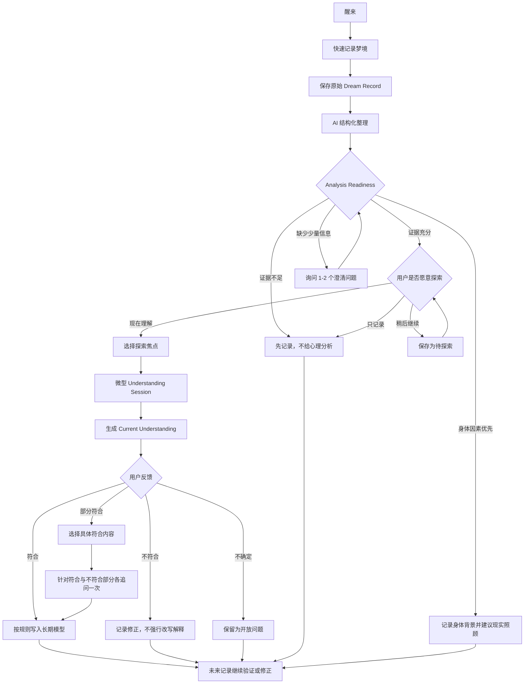
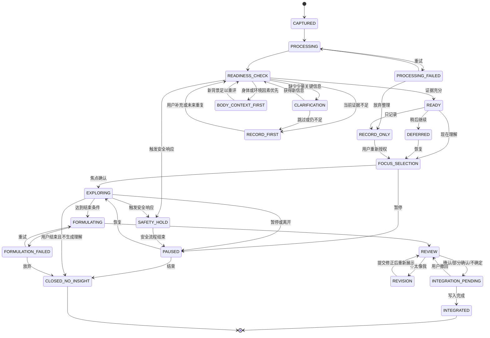

# Dream OS PRD v1.2

## MVP 产品架构、用户主流程与理解会话状态机

**状态：** Product Draft  
**版本：** v1.2  
**更新日期：** 2026-08-03  
**理论依据：** `Dream_OS_Whitepaper_v0.3`  

---

## 0. 文档目的

本文将 Dream OS 的研究理念转化为可供产品、设计、AI 与研发共同执行的 MVP 规范。白皮书回答“为什么这样做”，PRD 只回答：用户如何使用、系统如何响应、数据如何流动、哪些状态允许发生哪些动作。

本版重点完成：

- 产品核心对象与价值闭环；
- MVP 范围和信息架构；
- 从梦境记录到当前理解的主流程；
- 基于真实梦例建立“心理分析 / 仅记录”的双路径判断；
- Understanding Session 会话状态机；
- 记忆写入协议；
- 异常流程、安全边界与验收标准。

---

## 1. 产品定义

### 1.1 一句话定位

Dream OS 是一个通过长期梦境记录、结构化理解会话与用户反馈，帮助用户观察个人心理模式如何随时间变化的自我探索工具。

### 1.2 产品不是什么

- 不是固定象征词典；
- 不是一次性 AI 解梦器；
- 不是心理诊断工具；
- 不是无限延伸的心理咨询聊天；
- 不是用神经科学术语包装确定答案的报告生成器。

### 1.3 核心用户价值

用户不只获得梦境档案，而是在长期使用中逐步获得：

- 更完整的个人梦境记忆；
- 对梦中情绪与现实经验的可修正理解；
- 重复人物、关系、情绪和主题的时间线；
- 由用户参与确认的个人意象与心理模式；
- 对变化、反例和未解决问题的持续观察。

### 1.4 首版用户范围

MVP 仅面向能够自行同意数据处理的成年用户，不考虑未成年人使用场景。注册或首次使用时要求用户确认已成年。本阶段不设计监护人账户、未成年人同意或家庭共享机制。

---

## 2. 产品架构

Dream OS 由四个可独立迭代的系统组成：

| 系统 | 用户任务 | MVP 范围 | 主要产物 |
|---|---|---|---|
| Dream Capture | 尽快保留梦境 | 统一记录、语音/键盘输入、后续补充 | Dream Record |
| Dream Understanding | 用少量问题探索个人联系 | 2-5 分钟结构化会话 | Current Understanding |
| Self Model | 维护长期、可修正的个人理解 | 观察、候选模式、开放问题 | Working Self Model |
| Growth | 回顾模式如何变化 | MVP 仅保留基础时间线 | Understanding Timeline |

### 2.1 MVP 最小产品单元

```text
Dream Record
    保存真实材料
        ↓
Analysis Readiness Gate
    判断证据是否足以支持心理假设
        ↓
Understanding Session 或 Record Only
    分析清晰梦境；暂存证据不足的梦
        ↓
Current Understanding
    仅在证据充分时生成阶段性理解
```

Dream Record 是所有梦的共同入口；Current Understanding 不是所有梦的强制结果。证据不足的梦仍具有记录价值，可等待用户补充、现实背景出现或未来梦境形成重复模式。

---

## 3. 核心对象

### 3.1 Dream Record

用户对一次睡眠中主观体验的记录。

必须区分：

- `raw_content`：用户最初说过或写过的内容；
- `user_additions`：用户之后补充的新细节；
- `ai_observations`：AI 对人物、地点、动作与情绪线索的结构化观察。

AI 不得改写 `raw_content`，也不得把推断混入用户原始记忆。

### 3.2 Understanding Session

用户围绕一条 Dream Record，与 AI 共同完成的一次结构化自我探索过程。它不是普通聊天，也不是一次性报告。

一次会话只选择一个主要探索焦点，默认 3 个问题、2-5 分钟；只有用户主动深入或关键歧义未解决时，才增加至最多 5 个问题。

MVP 阶段严格采用“一条 Dream Record 对应一个 Understanding Session”。已完成会话因新增材料需要更新时，不创建第二个并列 Session，而是在原 Session 下生成新的理解版本。

### 3.3 Current Understanding

会话结束后形成的阶段性结果，必须包括：

1. 我们观察到；
2. 一个或多个可能理解；
3. 仍不确定的部分；
4. 以后可以继续观察；
5. 用户反馈状态。

### 3.4 Working Self Model

长期维护的工作模型，而非人格结论。包含：

- 人物与关系；
- 生活主题；
- 情绪模式；
- 个人意象；
- 候选模式；
- 开放问题；
- 支持材料与反例；
- 理解变更历史。

### 3.5 Analysis Readiness

系统对一条 Dream Record 是否具备心理分析条件的阶段性判断。它判断的不是“这个梦有没有意义”，而是“当前材料是否足以提出对用户有依据、可修正的心理假设”。

输出枚举：

- `ANALYSIS_READY`：材料足以进入 Understanding Session；
- `NEEDS_CLARIFICATION`：缺少少量关键信息，可询问 1-2 个澄清问题；
- `RECORD_FIRST`：目前不能形成可靠心理假设，先记录；
- `BODY_CONTEXT_FIRST`：身体感受、药物、疾病或环境刺激可能是更直接解释，先记录身体背景；
- `SAFETY_REVIEW`：包含现实危险或危机信号，先进入安全流程。

Analysis Readiness 不是诊断结果，也不永久固定。新增用户背景或未来重复梦境可能改变判断。

---

## 4. MVP 用户主流程



### 4.1 阶段一：唤醒记录

**目标：** 尽可能减少遗忘。  
**首屏主文案：**

> toto  
> 还记得刚才的梦吗？

Home 底部导航上方居中悬浮一个紧凑的 **记录梦境** 胶囊按钮，作为首页最重要的视觉焦点，但不得占满页面宽度。首页不显示键盘图标或其他并列入口。点击后进入便签记录状态，底部在原位置展开统一输入器：默认是文字输入框，右侧提供语音入口。文字和语音写入同一种 Dream Record。

点击“记录梦境”后不立即录音，而是进入便签页等待输入，并自动聚焦默认文字框、吊起键盘。便签正文顶部显示等待输入的光标；用户可以直接打字，或点击右下角麦克风开始语音输入；再次点击麦克风结束语音并将转写写入同一条 Dream Record。开始输入后首页引导文案隐藏，页面中部显示梦境记录便签。只有产生有效文字或完成一段有效语音后，页面才在便签卡片外部显示“保存梦境记录”；保存按钮不得成为便签卡片内容的一部分。

梦境便签显示创建日期与时间，并提供明确的“保存梦境记录”按钮。点击保存后，系统依据记录内容生成简短的描述性标题，例如“无法抵达的 B2”。自动标题用于识别记录，不得包含心理分析、象征解释或诊断；用户之后仍可修改标题。

保存前，页面左上角必须提供“返回”按钮，不将其放入梦境便签内部。返回只退出当前便签视图并保留本地草稿，不归档到 `Dreams`，也不删除内容；用户再次开始输入时恢复同一条草稿。删除草稿必须是单独且明确的操作。

保存完成后，Dream Record 归档到 `Dreams`。`Dreams` 保存用户历史上所有已保存梦境的原样记录，包括标题、完整记录时间、原始文字/转写和原始语音引用。AI 观察、心理假设或后续长期理解不得覆盖原样记录；同一便签再次保存时更新原记录而非创建重复项。

保存操作成功后，梦境便签通过缩小并朝底部 `Dreams` 导航收起的动画表达“已归档”，随后进入“梦已经保存”确认页，不自动开始理解。确认页明确询问“要现在开始理解这条梦吗？”，提供“现在开始理解”“稍后继续”“只保存，不理解”三个选择；用户选择前不得创建 Understanding Session。`Dreams` 标签显示红点，提示存在新保存但尚未查看的梦境；用户进入 `Dreams` 后红点自动清除。系统遵循操作系统的“减少动态效果”设置，以短淡出替代明显的位移动画。

进入 `Understanding` 后，系统默认展示用户近一段时间的阶段性心理状态整理，而不是空白的分析入口。整理必须明确区分：反复记录到的体验、用户已确认的理解、仍在观察的关系及各自证据；不得将其呈现为诊断或固定结论。状态整理下方展示最新梦境，并邀请用户“开始澄清这个梦”。只有用户明确选择后才进入解析流程；选择“稍后再说”不得生成新的心理理解，页面保留该梦境的待理解状态。Understanding Session 必须支持暂停、恢复，且恢复时继续显示上次的对话位置。
一条梦完成一次 `Understanding Session` 后，系统先生成 `DRAFT` 理解草稿，不得立即标记为已理解。只有用户明确选择“很贴近”并提交反馈后，Dream Record 才标记为 `UNDERSTOOD_ONCE`，进入理解历史，Dreams 卡片显示“已完成一次理解”且不再重复显示澄清入口。“部分贴近”“不太像”“还不能判断”均保留为未确认状态，不得写入稳定个人理解。只有用户补充新的梦境材料时，才在同一条 Dream Record 下创建新的理解版本并重新进入澄清流程。Understanding 确认完成后，近期状态整理同步更新更新时间、相关确认内容和证据数量；最新梦境区域改为“最近理解”，不再显示“开始澄清这个梦”。

用户选择澄清最新梦境后，MVP 不要求用户预先选择“先理解哪一部分”。系统可以引用刚才已向用户展示的近期状态整理，但首问仍必须优先从本次梦境中可验证的直接体验与情绪开始，不以未经确认的象征解释作为首问。其余问题依据已获得的信息按“确认体验 → 关键时刻 → 现实背景”的顺序逐题询问；界面一次只显示一个问题，并允许用户跳过。系统在获得必要信息后才生成阶段性理解。

Understanding Session 采用 AI 对话式交互。AI 以消息形式提供用户需要阅读的观察、当前问题和可直接回答的候选选项；点击候选选项即作为一条用户消息发送。用户也可以不使用候选项，通过底部统一输入栏自由打字或使用语音回答。候选项、文字与语音输入必须进入同一会话上下文和同一追问逻辑，不得被实现为互不连通的分支流程。AI 每次只推进一个问题，在收到用户回复后才发送下一问；达到理解门槛后，在对话内提供进入 Current Understanding 的入口。

`Dreams` 默认以可滚动卡片列表按记录时间倒序展示历史梦境。仅当天创建的梦境卡片在右上角提供“补充梦境”，点击后打开同一条 Dream Record 继续追加，保留原标题和原记录时间，保存后更新该记录；跨日后的历史梦境不再允许补充，只能查看原样记录。页面右上角提供日历入口，点击进入独立的“梦境日历”页面；有梦境记录的日期在数字下方显示圆点。点击有记录的日期后，页面在月历下方展示当天全部梦境卡片；无记录日期不可进入详情。圆点只表示当天存在至少一条记录，不代表分析完成度，也不展示心理判断。

梦境历史中，每个 Dream Record 只对应一张独立卡片，不使用叠层或错位纸张效果。卡片强化标题和完整记录日期：标题为第一层级，日期为第二层级，原样内容为第三层级。

用户可通过长按梦境卡片打开删除确认层。长按阈值约为 500ms，轻触、滚动和操作卡片内部按钮不得误触。确认层显示目标梦境标题并说明删除不可撤销，用户二次确认后才执行。删除 Dream Record 时必须同步删除或解除其原始语音、专属 Understanding Session、日历索引和图谱证据关系；由其他梦境共同支持的理解或图谱节点应重新计算，不得无条件级联删除。

要求：

- 语音录制中不打断、不追问、不实时解释；
- 原始语音默认在后台保留，用于回听、转写纠错与证据追溯；
- 常规使用流程不反复展示语音文件，但必须在首次使用与隐私设置中明确告知保留策略；
- 用户可以播放、导出或删除原始语音；删除语音不得同时删除已确认的文字记录，除非用户选择删除整条 Dream Record；
- 引导文案明确说明：“不必完整，一个画面、一种感觉或一个词也可以。”这用于降低记录压力，不作为独立功能或第三种输入模式；
- 保存成功后先给出轻量确认，不弹出长篇分析；
- 目标是醒来后一分钟内完成第一次保存，而不是一分钟内完成全部整理。

### 4.2 阶段二：原始梦境保存

保存后的卡片包含：

- 自动生成且可编辑的标题；
- 原始文本或语音；
- 记录时间；
- 醒来后的感受（可为空）；
- 操作：补充一点、稍后再说、一起理解这个梦。

### 4.3 阶段三：AI 结构化整理

后台可提取：

- 人物、地点、事件、动作；
- 明示情绪与待确认情绪；
- 身体感受、对话、显著意象；
- 梦境转折；
- 未明确内容。

结构化结果的用途是决定下一步问什么，不直接作为心理结论展示。

### 4.3.1 Analysis Readiness Gate

结构化整理后，系统先判断当前材料是否足以支持心理假设。默认立场是：**所有梦都可以记录，但并非所有梦都应立即分析。**

#### 可以进入心理分析的信号

至少存在两类相互支持的材料，并且没有更直接的单一解释：

- 用户明确表达了梦中情绪或醒后感受；
- 梦与已知现实事件在体验结构上存在具体联系；
- 用户对关键人物、地点或意象给出了个人联想；
- 同一主题在多个梦中重复或发生可解释的变化；
- 梦境叙事包含清晰的目标、阻碍、应对与结果；
- 用户主动确认某个候选联系贴近体验。

#### 应先记录的信号

- 只有孤立画面或元素，没有情绪、行动或个人联想；
- AI 只能依赖通用象征词典才能继续；
- 多种解释同样可能，且缺少区分它们的信息；
- 用户不愿意、不方便或暂时无法提供背景；
- 梦与近期媒体、环境或随机记忆重组存在明显直接联系；
- 身体不适、药物、发热、疼痛或外部刺激可能是更直接来源；
- 用户明确选择“只记录”。

#### 输出规则

证据充分时：

> “这个梦目前有几条与你现实体验相互支持的线索。我们可以形成一个阶段性心理假设，并保留其他可能。”

证据不足时：

> “目前的信息还不足以形成可靠的心理分析。我先帮你完整记录；如果以后出现相似梦境，或你想起相关情绪和现实背景，我们再一起看。”

身体因素明显时：

> “梦里的感受可能首先受到现实身体状态影响。我们可以同时记录身体背景，但不把它直接解释成心理象征。”

系统不得把“不能分析”包装成神秘或深层含义，也不得为了提高分析率而强行追问。

MVP 阶段，进入 `RECORD_FIRST` 后不允许用户强制要求 AI 给出心理分析。用户可以补充背景并触发重新评估，但不能绕过 Analysis Readiness Gate。这样可以避免产品在证据不足时退化成迎合式解梦工具。

### 4.4 阶段四：探索意愿确认

必须提供三个对等选择：

- **现在理解：** 用几分钟探索个人联系；
- **稍后继续：** 保存为待探索状态；
- **只记录：** 本次不进行任何分析或提问。

记录梦境不等于同意接受心理分析。

### 4.5 阶段五：选择探索焦点

使用“AI 推荐 + 用户选择”，优先级为：

```text
用户主动选择
> 醒来后残留情绪
> 梦中高强度体验
> 历史重复模式
> 显著变化或反转
> 理论意义
```

用户可选择“我也说不清，请你带我开始”。AI 可以推荐，但不得宣称某个焦点是梦的深层真相。

### 4.6 阶段六：微型理解会话

默认三轮：

1. **体验澄清：** 梦中最强烈的主观感受是什么；
2. **个人联想：** 这个人、地点或意象对用户本人意味着什么；
3. **现实连接：** 最近是否存在相似的情绪或关系体验。

用户随时可以：跳过、暂停、结束探索、选择不想谈。

### 4.7 阶段七：当前理解确认

AI 生成四块结构化结果，不输出长篇“解梦文章”。所有推断使用概率语言，并显示信息来源。

### 4.8 阶段八：用户反馈与模型更新

反馈选项：

- 很贴近我的感受；
- 有一部分贴近；
- 不太像我；
- 我还不能判断；
- 我想补充自己的理解。

当用户选择“不太像我”时，应询问不贴近的部分，而不是立刻生成另一套解释。

当用户选择“有一部分贴近”时，不允许直接把整段理解写入候选模式。系统必须继续让用户选择：

- 哪条观察符合；
- 哪个现实联系符合；
- 哪个心理假设符合；
- 哪部分不符合或尚不能判断。

随后最多追加两次追问：一次确认符合内容的准确边界，一次确认不符合内容的修正方向。只有被用户明确选中的部分可以进入候选模式。

---

## 5. Understanding Session 会话结构

### 5.1 接住梦

AI 复述一个可核对的观察，并询问是否准确。此阶段不解释。

### 5.2 确认探索焦点

一次只探索一个主焦点。用户拥有最终选择权。

### 5.3 个人意义探索

问题必须属于以下目的之一：

| 目的 | 需要了解什么 | 允许示例 |
|---|---|---|
| Clarify | 梦中实际发生了什么 | “你最后找到出口了吗？” |
| Affect | 用户体验到什么情绪 | “更接近着急、害怕，还是无助？” |
| Association | 元素对用户本人的联想 | “这个房子让你想到哪里？” |
| Context | 近期生活是否有相似体验 | “最近有类似无法推进的感受吗？” |
| Difference | 梦与现实有什么差异 | “梦里的他与现实中有什么不同？” |
| Pattern Check | 是否与历史记录形成重复或反转 | “这次的寻找与上次有什么不同？” |
| Disconfirm | 检查 AI 是否误读 | “有没有可能它与你的工作完全无关？” |

### 5.4 反映与共同理解

```text
AI 提出观察
    ↓
用户确认、修正或拒绝
    ↓
共同形成阶段性意义
```

### 5.5 形成当前理解

每个推断必须附带：

- 支持它的梦境材料；
- 支持它的用户回答；
- 置信状态；
- 至少一个替代解释或“不确定”；
- 未来可用于验证或反驳的观察点。

---

## 6. Conversation State Machine

### 6.1 设计目标

状态机必须保证：

- 会话可以暂停并安全恢复；
- 用户可以只记录、不探索；
- AI 不会在证据不足时直接形成结论；
- 用户未审核前，推断不能进入长期模型；
- 已完成会话可以补充材料，但不能静默改写历史结果；
- 每次状态变化可追踪。

### 6.2 状态定义

| 状态 | 含义 | 进入条件 | 允许动作 | 退出条件 |
|---|---|---|---|---|
| `CAPTURED` | 原始梦境已保存 | Dream Record 写入成功 | 补充、编辑原始记录、删除、只记录、开始整理 | 用户选择或结构化完成 |
| `PROCESSING` | AI 正在结构化整理 | 用户允许系统处理该记录 | 取消处理、查看原始记录 | 成功进入 READY；失败进入 PROCESSING_FAILED |
| `PROCESSING_FAILED` | 结构化未完成 | 转写或解析失败 | 重试、手动编辑、只记录 | 重试成功或放弃 |
| `READINESS_CHECK` | 正在判断是否具备分析条件 | 结构化整理完成 | 查看原始记录、补充背景 | 进入 READY、CLARIFICATION 或 RECORD_FIRST |
| `CLARIFICATION` | 缺少少量关键信息 | 预计 1-2 个问题可改变判断 | 回答、跳过、只记录 | 回到 READINESS_CHECK 或进入 RECORD_FIRST |
| `READY` | 具备分析条件 | 至少两类材料相互支持，且用户未拒绝探索 | 现在理解、稍后继续、只记录 | 用户选择 |
| `RECORD_FIRST` | 当前证据不足，先记录 | 缺少情绪、背景、个人联想或区分性证据 | 补充、查看、未来重评 | 新材料触发 READINESS_CHECK |
| `BODY_CONTEXT_FIRST` | 身体或环境因素可能更直接 | 用户报告相关身体、药物或环境背景 | 记录背景、停止象征化分析、未来重评 | 新材料触发 READINESS_CHECK |
| `DEFERRED` | 用户选择稍后探索 | 用户主动选择 | 恢复、只记录、删除 | 恢复或关闭 |
| `RECORD_ONLY` | 本次明确不探索 | 用户主动选择 | 查看、补充、未来主动开启探索 | 用户未来重新授权 |
| `FOCUS_SELECTION` | 正在选择一个探索焦点 | 用户选择现在理解 | 选择焦点、让 AI 引导、暂停、退出 | 焦点确认 |
| `EXPLORING` | 结构化问答进行中 | 焦点已确认 | 回答、跳过、暂停、不想谈、结束探索 | 完成、暂停或安全中断 |
| `PAUSED` | 会话暂时停止 | 用户离开或主动暂停 | 恢复、结束、只保存记录 | 用户选择 |
| `FORMULATING` | AI 正在生成阶段性理解 | 探索达到结束条件 | 取消、返回查看回答 | 成功进入 REVIEW；失败进入 FORMULATION_FAILED |
| `FORMULATION_FAILED` | 理解生成失败 | 模型或数据错误 | 重试、结束且不生成理解 | 重试成功或放弃 |
| `REVIEW` | 等待用户确认或修正 | Current Understanding 草稿生成 | 确认、部分确认、拒绝、不确定、补充 | 用户提交反馈 |
| `REVISION` | 正在收集用户修正 | 用户指出不贴近 | 选择错误类型、补充说明、返回审核 | 修正提交 |
| `INTEGRATION_PENDING` | 等待执行长期写入 | 用户完成审核 | 撤回、查看写入预览 | 写入完成或用户取消 |
| `INTEGRATED` | 已完成并按规则写入 | 写入协议完成 | 查看、建立后续会话、补充新证据 | 终态；新证据产生新版本 |
| `CLOSED_NO_INSIGHT` | 本次未形成有效理解 | 用户结束或双方无可靠关联 | 查看、未来重新探索 | 终态，可创建新会话 |
| `SAFETY_HOLD` | 已切换安全响应 | 检测到现实危险或危机信号 | 安全确认、现实支持、危机资源、退出 | 安全流程结束 |

### 6.3 主状态转换



### 6.4 状态守卫条件

#### `READY → FOCUS_SELECTION`

- 用户明确选择“现在理解”；
- Dream Record 未被删除；
- 原始内容满足最小输入：至少一个可识别片段、情绪、人物、地点或画面；
- 当前不存在未处理的安全限制。

#### `READINESS_CHECK → READY`

必须同时满足：

- 至少两类相互独立的材料支持同一候选方向，例如“梦中情绪 + 现实背景”或“个人联想 + 历史重复”；
- 不依赖固定象征词典即可说明推理链；
- 至少保留一个合理的替代解释；
- 若存在身体、药物或环境因素，已将其作为优先解释或并列解释；
- 当前分析的潜在价值高于误导风险。

不得仅凭梦境“很生动”“很奇怪”或单个意象进入 `READY`。

#### `READINESS_CHECK → RECORD_FIRST`

满足以下任一条件：

- 只有单一元素且无个人背景；
- 用户无法或不愿补充关键体验；
- 解释主要来自 AI 的一般知识，而非用户材料；
- 候选解释无法被后续问题区分；
- 当前只能形成事实观察，不能形成有依据的心理假设。

#### `EXPLORING → FORMULATING`

满足以下任一条件：

- 完成默认三轮且信息足以形成至少一条观察；
- 用户明确要求结束并查看当前理解；
- 达到五个问题上限；
- 继续提问的边际价值低于打扰成本。

若只能形成事实观察而不能形成合理假设，仍可输出“本次未形成明确关联”，不得为完成流程而编造解释。

#### `REVIEW → INTEGRATION_PENDING`

- 用户已选择反馈状态；
- 写入预览能区分观察、候选模式与用户确认含义；
- 被用户拒绝的内容已标记为反证，不进入正向模型。

### 6.5 暂停与恢复

系统保存：

- 当前状态；
- 已确认焦点；
- 已回答问题；
- 被跳过或“不想谈”的主题；
- 剩余问题预算；
- 会话摘要，但不把摘要当作用户原话。

恢复时先展示一条上下文确认：

> “上次我们停在‘最近是否也有无法推进的感觉’。你想从这里继续，换一个方向，还是结束这次探索？”

不得假装会话从未中断。

### 6.6 重开与版本控制

已 `INTEGRATED` 的会话不允许静默修改。用户补充新材料时：

- 原结果保留为 `understanding_version_n`；
- 新增补充材料记录来源与时间；
- 创建 `understanding_version_n+1`；
- 显示哪些结论被加强、削弱、替换或保留；
- 长期模型同步记录变更历史。

---

## 7. AI 提问与输出协议

### 7.1 问题选择评分

候选问题可按以下维度评分：

- `user_relevance`：是否围绕用户选定焦点；
- `information_gain`：回答是否会改变当前理解；
- `personal_grounding`：能否获取用户个人联想；
- `disconfirmation_value`：能否发现 AI 正在误读；
- `emotional_cost`：问题是否可能造成不必要负担；
- `redundancy`：是否已经问过同类问题。

选择高相关、高信息增益、低冗余、风险可接受的问题。

### 7.2 禁止规则

AI 不得：

- 诱导用户接受预设含义；
- 强行建立梦与现实的因果关系；
- 使用固定象征结论；
- 根据梦境诊断用户；
- 暗示梦境证明某段被压抑记忆真实发生；
- 把用户否认解释为“防御”或“抗拒”；
- 用“你的潜意识在告诉你”作为确定陈述；
- 在用户选择“不想谈”后换一种问法继续追问。

### 7.3 输出证据层级

| 层级 | 写法 | 是否可进入长期模型 |
|---|---|---|
| Observation | “你在梦里三次尝试开门，都没有成功。” | 可作为单次观察 |
| Candidate Pattern | “无法进入可能与近期受阻感有关。” | 需标记待验证 |
| Personal Understanding | “对你而言，电梯故障常与无法推进事情相关。” | 需多次证据和用户确认 |
| Rejected Interpretation | “用户明确否认与工作压力相关。” | 作为反证保存 |

### 7.4 Analysis Readiness 决策模型

系统不展示伪精确的“心理分析概率”。内部采用“规则硬门槛 + 模型动态评分”：规则负责不可突破的边界，模型负责根据具体梦境和用户历史评估证据质量，最终必须保留可解释理由。

#### 规则硬门槛

以下任一条件成立时，模型评分不能覆盖规则：

- 用户选择只记录或不想谈；
- 缺少最小梦境材料；
- 分析主要依赖固定象征词典；
- 明显身体、药物或环境因素尚未优先处理；
- 存在安全风险；
- 用户为未成年人（首版不提供服务）；
- 当前状态为 `RECORD_FIRST`，MVP 不允许用户强制绕过。

#### 模型动态评分

通过硬门槛后，模型结合当前梦境、用户回答、现实背景与历史记录，动态评估 Emotional Clarity、Personal Grounding、Waking Continuity、Repetition、Narrative Structure、Alternative Control 和 User Consent。模型返回：

- 路由建议；
- 支持该路由的具体证据；
- 缺失信息；
- 主要替代解释；
- 是否可通过最多两个澄清问题改变判断。

这套混合方式优于纯规则或纯模型：纯规则难以处理个人语境，纯模型则可能为了“给答案”而越过安全和证据边界。

| 维度 | 正向信号 | 风险信号 |
|---|---|---|
| Emotional Clarity | 用户能说明梦中或醒后情绪 | 只有 AI 猜测情绪 |
| Personal Grounding | 有用户本人确认的联想 | 只能引用通用象征 |
| Waking Continuity | 与现实事件有具体体验结构对应 | 仅存在表面词语相似 |
| Repetition | 历史梦中出现相似或反转模式 | 单次孤立出现 |
| Narrative Structure | 目标、阻碍、应对、结果可辨 | 仅零散画面 |
| Alternative Control | 已考虑身体、药物、环境和近期媒体 | 忽略更直接来源 |
| User Consent | 用户明确愿意探索 | 用户只想记录或不想谈 |

推荐路由：

- 多个正向信号相互支持，且风险可控：`ANALYSIS_READY`；
- 只缺一两个区分性信息：`NEEDS_CLARIFICATION`；
- 只有孤立内容或一般性解释：`RECORD_FIRST`；
- 身体或环境来源明显：`BODY_CONTEXT_FIRST`；
- 现实安全风险：`SAFETY_REVIEW`。

### 7.5 真实梦例校准

以下案例用于校准产品行为，不把历史 AI 输出当作已证实结论。

#### Case 001：B2 没有按钮

**原始材料：** 用户在地库找自己的车，记得车可能在 B2；电梯没有 B2 按钮，视线难以聚焦。后来用户补充近期视力下降、未持续遵循治疗安排，以及生活和创造方向变化等背景。

**正确路由：** `BODY_CONTEXT_FIRST → NEEDS_CLARIFICATION`。

**原因：** “看不清”首先存在明确身体来源，不能直接象征化。关于行动延迟、自我照顾或生活变化的联系，只能作为用户补充后形成的候选假设。

**允许输出：**

> “梦里的视线模糊可能首先受到现实视力状态影响。你同时提到知道需要处理却一直推迟，这让‘看不清、无法到达’与现实行动延迟出现了一个可探索的联系；目前还不能判断车或 B2 具有稳定的个人含义。”

**禁止输出：** 直接断言“B2 代表稳定自我”“车代表职业能力”或“梦在提醒你启动新事业”。

#### Case 002：收到 Alex 的邮件回复

**原始材料：** 现实中用户等待 Alex 回复邮件；短梦中收到回复并感到开心，醒后短暂以为真实，查看邮箱后确认没有邮件。

**正确路由：** `ANALYSIS_READY`。

**原因：** 现实情境、梦中事件和明确情绪直接对应，不需要固定象征即可形成低推断度理解。

**允许输出：**

> “这个梦很可能延续了你当时等待回复的现实情境，并在梦中模拟了期待结果。它说明这次联系对你有情绪价值；是否涉及更长期的关系安全感，还需要更多记录支持。”

**禁止输出：** 由一次梦诊断依恋类型，或断言“邮件就是关系确认的个人象征”。

#### Case 003：快速开车后落入湖中

**原始材料：** 现实中用户曾赶时间快速开车去见 Alex；梦中快速急切驾驶，转弯后车辆落入湖里，用户轻松上岸并看着车下沉。

**正确路由：** `NEEDS_CLARIFICATION`，获得梦中情绪与用户联想后才可进入 `ANALYSIS_READY`。

**原因：** 快速驾驶与现实经历有直接连续性，但“车下沉”“轻松上岸”的个人意义并不清楚。戏剧性画面本身不能证明放下旧驱动方式或关系转变。

**优先问题：**

- 上岸后更接近轻松、吃惊、惋惜，还是无所谓？
- 看着车下沉时，你最在意的是车、事故，还是自己已经安全？
- 现实中的赶路经历是否让你感到压力或危险？

#### Case 004：远途火车与雪景

**原始材料：** 用户坐火车从一个地方去很远的地方，看风景、下雪；缺少明确情绪、现实背景与个人联想。

**正确路由：** `RECORD_FIRST`。

**原因：** 画面清楚不等于心理含义清楚。当前无法区分旅行记忆、审美体验、未来期待或随机重组。

**允许输出：**

> “我先帮你记录这段远途、风景和雪。目前还不足以判断它反映了哪种心理状态。如果你记得当时是平静、期待、孤独还是被动，我们以后可以继续补充。”

**禁止输出：** 直接生成“旅程接受假设”或“你开始允许自己顺其自然”。

### 7.6 从案例得到的产品结论

1. 梦境画面清晰度与心理可分析度是两个不同变量。
2. 现实事件与梦中体验直接对应时，可给出低推断度分析。
3. 单个意象的象征性解释属于高推断，必须有用户联想或长期重复支持。
4. 身体状态具有解释优先权，但身体解释与心理体验可以并存，不能虚构比例。
5. 分析应从最低必要推断开始，用户确认后再逐步提高抽象层级。
6. `RECORD_FIRST` 是正常且有价值的产品结果，不应被视为模型失败。

---

## 8. Memory Write Protocol

详细实体、字段、证据链、版本、删除回滚及 MVP 工程决策见：`Dream_OS_Memory_Write_Protocol_v1.1.md`。本章保留产品级摘要，独立规范作为设计与研发实施依据。

### 8.1 四级记忆

1. **Raw Material：** 原始梦境与用户原话；
2. **Observation：** 单次会话中可核对的观察；
3. **Candidate Pattern：** 可能存在但尚待验证的模式；
4. **Personal Understanding：** 多次证据、用户确认且没有明显反证的个人含义。

### 8.2 写入规则

| 数据类型 | 自动保存 | 需要用户确认 | 可被 AI 改写 |
|---|---|---|---|
| 原始梦境 | 是 | 记录时已授权 | 否 |
| 用户补充 | 是 | 是 | 否 |
| AI 结构化观察 | 是 | 审核时可纠正 | 可重新计算，需保留版本 |
| 单次理解草稿 | 临时保存 | 是 | 可在审核前更新 |
| 候选模式 | 否 | 是 | 可升降级，保留历史 |
| 个人含义 | 否 | 明确确认 | 不得静默修改 |
| 被拒绝解释 | 是，作为反证 | 用户拒绝即确认 | 否 |

### 8.3 候选模式升级条件

至少综合：

- 多条梦境支持；
- 用户个人联想具有一定一致性；
- 有现实经验联系；
- 用户明确确认；
- 没有强反证；
- 意义在不同场景中仍保持可识别性。

重复次数本身不触发自动升级。系统只能建议用户保存为持续观察主题。

“Personal Understanding”的最低证据门槛由模型根据实际情况动态评分，但必须满足固定前置条件：存在多条来源可追溯的支持材料、用户明确确认、没有未处理的强反证，并完成一次写入预览。模型负责判断证据组合质量，固定规则负责保证底线。

### 8.3.1 历史梦境引用透明度

AI 每次引用历史梦境或历史理解时，用户都必须有清晰感知。输出中以可展开引用卡显示：

- 被引用梦境的标题与日期；
- 引用的原始片段或已确认观察；
- 本次引用目的，例如“检查重复”“比较变化”或“寻找反例”；
- 查看完整记录入口。

AI 不得在后台使用历史梦境形成心理结论，却只向用户展示结论而隐藏来源。用户可以在单次会话中关闭历史引用；关闭后，本次模型不得继续使用相关历史内容。

### 8.4 删除与模型回滚

当用户删除一条 Dream Record：

- 删除或脱敏其原始数据；
- 标记所有依赖该记录的观察与候选模式；
- 重新计算证据强度；
- 若模式失去最低证据，应降级或移除；
- 保留必要的操作审计，但不得保留已删除的梦境正文。

### 8.5 暂停长期建模

用户可以暂停长期建模，是因为梦境、关系、身体和心理假设都属于高度敏感信息。即使“长期理解”是产品核心价值，也不能把继续建模变成不可撤回的默认承诺。

这里需要区分三个动作：

| 用户动作 | 后续数据 | 历史理解 | 原始梦境 |
|---|---|---|---|
| 暂停长期建模 | 不再写入或调用长期模型 | 只读保留，可导出 | 保留 |
| 清空长期模型 | 不再写入，直到重新开启 | 删除模型结论和候选模式 | 默认保留 |
| 删除全部数据 | 不再处理 | 删除 | 删除 |

暂停后，用户仍可记录梦境和查看过去内容，但系统只进行单条记录处理，不跨梦引用、不生成长期模式。历史理解可以导出为 Markdown 或结构化 JSON。重新开启时，系统必须再次说明将使用哪些历史数据，不得自动恢复。

---

## 9. 异常与安全流程

### 9.1 用户只记得碎片

允许保存。AI 可询问是否还记得一个人、一种情绪、一个地点或一个画面，但不得补全故事。

### 9.2 用户认为梦没有意义

接受并结束探索：

> “它也可能只是近期记忆的重组。我们可以只保留记录，不必一定为它找到意义。”

### 9.3 未形成有效理解

状态进入 `CLOSED_NO_INSIGHT`，结果显示“本次未形成有效理解”。这不是错误，也不降低用户记录价值。

### 9.4 用户开始讨论现实困扰

可记录为背景，但不将产品扩展为无限心理咨询：

> “这件现实经历似乎比梦本身更重要。我们可以把它记录为背景，但不必强行解释成因果关系。”

### 9.5 创伤、现实危险或危机信号

进入 `SAFETY_HOLD`：

- 停止象征分析和深度追问；
- 区分梦境内容与现实危险；
- 询问用户此刻是否安全；
- 建议用户联系身边可信任的人、当地紧急服务或合格专业人员；
- 不鼓励沉浸式重演；
- 安全流程结束后，由用户决定是否恢复原会话。

MVP 暂不建设按国家和语言维护的危机资源数据库。完整本地化资源策略列为后续版本；在此之前，产品不得声称提供覆盖各地区的危机干预服务。基础的停止分析、安全确认和现实求助提示仍为 P0。

---

## 10. MVP 信息架构与页面

### 10.1 一级导航

```text
首页
梦境
理解
梦图谱
```

MVP 将 `Settings` 收入 `Me` 二级页面，避免移动端底部导航过度拥挤。详细页面、组件和状态规范见 `05_UX/Dream_OS_Page_Level_Wireframe_Spec_v1.0.md`。

### 10.2 六类核心页面

#### Home

- 底部悬浮“记录梦境”主按钮；点击后展开默认文字、右侧语音的统一输入器；
- 首页左上角提供仅含菜单/历史图标的入口，打开“理解历史”抽屉。抽屉承载账号摘要、最近完成的理解和按梦境关联的历史 Understanding Session；只完成过一次理解的会话才进入历史记录，未完成理解仍从 `Understanding` 进入。它不复制 `Dreams` 的原始梦境内容。
- 账号摘要在 MVP 只展示昵称、个人空间、梦境数量和已完成理解次数；隐私、导出和删除等设置保留为后续二级入口。
- 从抽屉点击任意 Understanding Session 后进入独立的理解记录详情页；详情页左上角使用仅含返回箭头图标的按钮，点击后回到理解历史抽屉，而不是回到 Home 或重新开始会话。
- 已完成的 Understanding Session 必须保存真实会话轨迹：AI 问题、用户回答、AI 理解草稿、用户反馈和完成时间。详情页优先展示真实轨迹，不能用固定示例摘要冒充历史对话。
- 降低完整性压力的引导文案；
- 底部一级导航。

MVP Home 不展示未完成理解、最近梦境、最近一次 Current Understanding 或持续观察主题。未完成会话通过 `Understanding` 导航提示点进入；梦境历史位于 `Dreams`；候选模式和持续观察位于 `Understanding`。Home 始终保持为纯记录起点，不随数据积累变成信息流。

#### Dream Capture

- Home 的两个入口直接进入同一记录页对应的初始输入状态；
- 同一页面内使用语音或键盘输入，并可切换；
- 暂停、继续、完成；
- 引导用户不必追求完整叙事；
- 原始记录确认。

#### Dream Detail

- 原始梦境；
- 用户补充；
- 基础信息；
- Understanding Session 状态；
- 当前理解及版本历史。

#### Understanding Session

- 一次一个问题；
- 显示阶段，不承诺固定题数；
- 跳过、稍后继续、不想谈、结束探索；
- 清楚区分 AI 观察与用户表达。

#### Current Understanding

- 我们观察到；
- 一个或多个可能理解；
- 不确定项；
- 继续观察；
- 用户反馈与修正入口；
- 写入长期模型预览。

#### Understanding Archive

- 历史理解；
- 已修正或被替换的理解；
- 候选模式；
- 开放问题；
- 支持证据与反例。

#### Me / 我的梦境图谱

- 以高频个人意象为中心展示轻量关系网络；
- 同时呈现多个达到重复门槛的个人意象，不得把最高频意象误表现为用户唯一的核心象征；
- 采用多节点互联结构：中心节点只代表当前查看焦点，不构成唯一父节点；其他意象、情节、感受和个人理解之间可依据证据互相连接；
- 连接共同出现的内容、重复情节、伴随感受和个人理解；
- 明确区分记录事实、用户已确认和正在观察；
- 每一个可见节点均可点击，使用统一详情结构查看出现次数、最近出现、相关关系、证据状态、依据和原始梦境；只有用户已确认的节点才使用基于该用户证据的“对你目前可能意味着”，记录事实和正在观察节点必须使用更弱的描述，不得输出脱离证据的固定象征解释；
- Settings 作为二级入口。

MVP 暂不构建复杂人格图谱、可自由探索的“梦境宇宙”或大规模网络可视化；只提供移动端可读、证据状态清晰的个人梦境图谱。

---

## 11. 功能优先级

### P0：MVP 必须具备

- 语音/文字梦境记录；
- 原始内容与 AI 内容分层；
- 探索意愿确认；
- 焦点选择；
- 3-5 问结构化会话；
- 暂停与恢复；
- Current Understanding 生成；
- 多档用户反馈；
- 观察、候选模式与反证写入；
- 梦境与理解历史；
- Me 中的轻量“个人梦境图谱”：高频意象、共现关系、用户确认关系和正在观察关系；
- 删除、导出和退出长期建模；
- 基础安全切换。

### P1：验证后扩展

- 可自由缩放、拖拽和筛选的完整个人意象网络；
- 模式时间线；
- 月度回顾；
- 多个梦的联合理解会话；
- 可穿戴设备数据；
- 更完整的增长与变化视图。

### P2：暂不进入

- 梦境社区；
- 公共梦境词典；
- 临床诊断；
- 自动人格类型；
- 梦境预言；
- 强游戏化和连续签到惩罚；
- 无上限的通用心理聊天。

---

## 12. 核心指标

### 12.1 激活与完成

- 首次梦境记录完成率；
- 首次记录中位耗时；
- 会话启动率；
- 会话完成率；
- 暂停后恢复率。

### 12.2 理解质量

- “贴近”与“部分贴近”比例；
- 不确定率；
- 用户主动修正率；
- AI 推断被明确拒绝的比例；
- 未形成理解但被用户接受的比例。
- Analysis Ready 后用户认为“有依据”的比例；
- Record First 后因新增信息而成功重评的比例；
- 身体因素明显但仍被错误象征化的比例。

修正率不是失败指标。完全没有修正可能意味着用户缺少控制权，或产品具有过强的暗示性。

### 12.3 长期价值

- 7/30/90 日梦境回访率；
- 历史数据在新会话中的有效引用率；
- 候选模式被确认、降级或否定的比例；
- 用户主动查看理解历史的频率；
- 用户认为系统“比过去更理解我”的变化。

### 12.4 安全与信任

- 用户撤回长期写入的比例；
- 删除操作成功率与完成时间；
- 不想谈选项被尊重率；
- 被用户举报为武断、诊断化或诱导的输出率；
- 安全响应的人工审查通过率。

---

## 13. MVP 验收标准

### Dream Capture

- 用户可在无标题、无标签、无完整叙事时保存一个片段；
- 断网或转写失败不丢失原始录音；
- AI 不修改原始记录；
- 用户可补充但能看出补充发生的时间。

### Understanding Session

- 未获得探索授权时不提心理问题；
- 每个 AI 问题可映射到一个明确问题目的；
- 默认三问，最多五问；
- 跳过、不想谈、暂停和结束均可用；
- 恢复后能正确说明上次停留位置；
- 用户拒绝某个方向后不会被换词追问。

### Analysis Readiness Gate

- 每条已结构化梦境必须产生一种明确路由：分析、澄清、先记录、身体背景优先或安全审查；
- 仅凭单一意象或通用象征不得进入 `ANALYSIS_READY`；
- `NEEDS_CLARIFICATION` 最多提出两个用于改变路由判断的问题；
- 用户跳过澄清问题后，系统进入 `RECORD_FIRST`，不继续追问；
- `RECORD_FIRST` 页面不展示伪装成“初步分析”的心理结论；
- 新背景或重复梦境可以触发重新评估，但必须向用户说明触发原因；
- 身体因素存在时，输出必须先呈现身体/环境解释，且不得虚构心理与身体的权重比例。

### Current Understanding

- 事实、用户联想和 AI 假设可区分；
- 至少显示一项不确定性；
- 不使用诊断、预言或固定象征结论；
- 用户可以部分确认、拒绝和补充；
- 未经审核不写入长期模型。

### Self Model

- 可查看每条模式的支持证据与反例；
- 删除原始梦境后依赖关系会重新计算；
- 个人含义不会被静默改写；
- 所有模型更新有版本记录。

---

## 14. 已确认产品决策

| 编号 | 议题 | MVP 决策 |
|---|---|---|
| D-01 | 原始语音 | 默认后台保留；常规流程弱感知，但首次使用和隐私设置必须明确披露，并支持播放、导出和删除 |
| D-02 | 一梦多会话 | 一条 Dream Record 对应一个 Understanding Session；新增材料通过版本更新处理 |
| D-03 | “部分符合” | 用户继续选择具体符合项；系统最多追加两次边界澄清，只写入明确确认部分 |
| D-04 | 历史梦境引用 | 每次引用均显示日期、片段、用途和查看入口；允许本次会话关闭历史引用 |
| D-05 | Personal Understanding 门槛 | 模型动态评估证据组合，固定规则保证用户确认、来源可追溯和反证处理 |
| D-06 | 年龄范围 | MVP 仅面向成年人，不设计未成年人或监护流程 |
| D-07 | 危机资源本地化 | MVP 不建设多地区资源数据库；保留基础停止分析、安全确认和现实求助提示 |
| D-08 | 暂停长期建模 | 允许暂停；历史理解只读保留并可导出，同时提供清空模型和删除全部数据的独立选项 |
| D-09 | Analysis Readiness | 采用规则硬门槛与模型动态评分结合的混合机制 |
| D-10 | RECORD_FIRST 绕过 | MVP 不允许强制绕过；用户只能补充材料后重新评估 |

### 14.1 仍需在详细设计中定义

- 原始语音默认保留期限、存储加密和备份删除周期；
- “部分符合”选择器的具体交互与拆分粒度；
- 历史引用卡在会话中的视觉层级；
- 模型动态评分的评估集、阈值校准和人工审查方法；
- 暂停、清空和删除三个入口的二次确认与恢复规则。

---

## 15. 下一阶段交付物

按依赖顺序推进：

1. **Memory Write Protocol 数据字段版：** 明确实体、字段、来源、置信度和版本关系；
2. **Page-Level Wireframe Spec：** 为六类页面定义模块、状态、空态、错误态和跳转；
3. **Safety Protocol：** 与专业人员共同制定风险识别、响应和升级机制；
4. **AI Prompt & Evaluation Spec：** 把提问目的、禁止规则和输出证据层级转为可测试规范；
5. **MVP Technical Spec：** API、数据库、异步任务、语音转写与模型调用架构。

当前已完成：`Dream_OS_Memory_Write_Protocol_v1.1.md` 与 `Dream_OS_Analysis_Readiness_Evaluation_Spec_v1.0.md`。

页面级规范已完成：`05_UX/Dream_OS_Page_Level_Wireframe_Spec_v1.0.md`。

---

## 版本说明

- 本稿整合了既有 Product Architecture、Understanding Session 与 MVP User Flow 讨论。
- 本轮新增 Conversation State Machine、状态守卫、暂停恢复、版本控制、Memory Write Protocol 与验收标准。
- v1.1 根据四个真实梦例新增 Analysis Readiness Gate，将产品改为“证据充分则分析，证据不足则先记录”的双路径模型。
- v1.1 明确身体因素优先、心理假设分级、案例校准和不分析时的产品文案。
- v1.2 确认十项 MVP 产品决策：后台保留语音、一梦一会话、部分符合细分确认、历史引用透明、成年用户范围、长期建模控制及混合式 Analysis Readiness。
- 本稿为产品与研发工作底稿，不构成医疗或心理专业建议。
